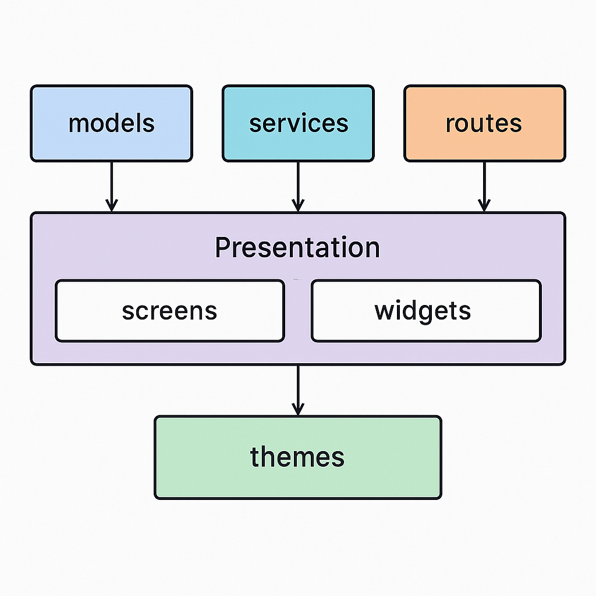

# 📦 IasyStock – Sistema Inteligente de Gestión de Inventarios

_IasyStock_ es una aplicación móvil desarrollada en Flutter que permite a pequeñas y medianas empresas gestionar eficientemente su inventario mediante inteligencia artificial.
El sistema reconoce productos a través de la cámara, etiqueta o factura, y permite registrar entradas o salidas directamente desde el dispositivo móvil.
Tambien incluye un asistente virtual para consultas y generación de reportes.

---

## 🧭 Navegación del Proyecto

```bash
lib/
├── models/                    # Modelos de datos del dominio
│   └── category.dart
├── routes/                    # Definición de rutas de navegación
│   └── app_routes.dart
├── screens/                   # Pantallas principales de la app
│   ├── home/                  # Funcionalidades base del home
│   │   ├── statistics/        # Visualizaciones estadísticas
│   │   ├── action_selection_screen.dart
│   │   ├── ai_assistant_screen.dart
│   │   ├── camera_screen.dart
│   │   ├── confirm_image_screen.dart
│   │   ├── low_stock_screen.dart
│   │   └── review_recognized_data_screen.dart
│   ├── menu/                  # Listados por módulos funcionales
│   │   ├── audit_log_list_screen.dart
│   │   ├── category_list_screen.dart
│   │   ├── ...
│   ├── user_options/          # Preferencias del usuario
│   │   ├── about_screen.dart
│   │   ├── change_theme_screen.dart
│   │   ├── ...
│   ├── home_screen.dart
│   ├── main_screen.dart
│   ├── menu_screen.dart
│   └── user_options_screen.dart
├── services/                  # Lógica de conexión a APIs
│   └── api_service.dart
├── themes/                   # Configuración de temas claro/oscuro
│   ├── dark_theme.dart
│   └── light_theme.dart
├── widgets/                   # Widgets reutilizables
│   └── category_card.dart
└── main.dart                  # Punto de entrada de la app
```

---

## 🚀 Funcionalidades principales

- 📷 **Reconocimiento de productos con IA** (desde cámara o imagen)
- 🤖 **Asistente virtual** para consultas y generación de reportes
- 🧾 **Ingreso automático al inventario** mediante revisión de datos extraídos
- 📊 **Estadísticas de bajo stock y ventas**
- 🧑‍💼 **Gestión de usuarios, categorías, productos y promociones**
- ⚙️ **Ajustes del sistema y configuración visual**
- 🔒 **Historial de acciones (Audit Log)**
- 🎨 Modo claro/oscuro configurable

---

## 🧠 Arquitectura del Proyecto

Esta aplicación está desarrollada bajo principios de **Clean Architecture**, separando claramente:

- **Modelo de Dominio** (`models/`)
- **Capa de Presentación** (`screens/`, `widgets/`)
- **Capa de Servicios** (`services/`)
- **Ruteo y Navegación** (`routes/`)
- **Estilos de UI** (`themes/`)

Puedes ver el diagrama completo aquí:



---

## 🔗 Rutas y Navegación

El archivo `app_routes.dart` define de forma centralizada todas las rutas utilizadas en la aplicación. Ejemplos:

```dart
'/home': (context) => const HomeScreen(),
'/camera': (context) => const CameraScreen(),
'/ai-assistant': (context) => const AIAssistantScreen(),
```

---

## 🛠️ Tecnologías utilizadas

- **Flutter** 3.x
- **Dart**
- **Material Design**
- **API REST**
- **Reconocimiento de imágenes con IA (OpenAI API)**

---

## 📱 Capturas de pantalla

Puedes agregar imágenes aquí para mostrar la funcionalidad de la app:

- 🖼️ Pantalla principal
- 🖼️ Pantalla de reconocimiento por cámara
- 🖼️ Pantalla de revisión de datos detectados
- 🖼️ Módulo de estadísticas

---

## 📂 Organización por módulos

Cada módulo funcional (inventario, promociones, ventas, etc.) tiene su propia pantalla de listado y puede extenderse fácilmente para CRUD completo. Ejemplo:

- `product_list_screen.dart`
- `sale_item_list_screen.dart`
- `warehouse_list_screen.dart`

---

## 🧪 Pruebas

```bash
# Ejecutar todos los tests
flutter test

# Ejecutar análisis de código
flutter analyze

# Ejecutar tests con coverage
flutter test --coverage
```

---

## 🚢 Despliegue a Play Store con CodeMagic

IasyStock cuenta con un sistema de CI/CD completo para despliegue automatizado a Google Play Store usando CodeMagic.

### 📚 Documentación de Despliegue

Toda la documentación de despliegue está disponible en:

```
/iasystock-devops/documentation/
├── RESUMEN_DESPLIEGUE_PLAYSTORE.md           # ⭐ Inicio rápido (recomendado)
├── GUIA_DESPLIEGUE_CODEMAGIC_PLAYSTORE.md    # Guía completa paso a paso
└── CODEMAGIC_VARIABLES_SETUP.md              # Configuración de variables
```

### ⚡ Quick Start

```bash
# 1. Generar keystore de firma
cd ../iasystock-devops/scripts-dev
./generate-keystore.sh

# 2. Validar configuración
./validate-codemagic-setup.sh

# 3. Build local de prueba
cd ../../iasy_stock_app
flutter build appbundle --release
```

### 🔄 Workflows Disponibles

El proyecto incluye 5 workflows configurados en [codemagic.yaml](codemagic.yaml):

1. **`firebase_distribution`** - Testing interno con Firebase App Distribution
2. **`playstore_internal`** - Internal testing en Play Store (rama `release/*`)
3. **`playstore_beta`** - Beta testing en Play Store (rama `beta/*`)
4. **`playstore_production`** - Producción en Play Store (tag `v*.*.*`)
5. **`local_test_build`** - Builds de desarrollo (rama `develop` y `feature/*`)

### 📦 Despliegue Automático

#### Internal Testing
```bash
git checkout -b release/1.0.1
# ... hacer cambios ...
git push origin release/1.0.1
# CodeMagic desplegará automáticamente
```

#### Producción
```bash
git tag v1.0.1
git push origin v1.0.1
# CodeMagic compilará y subirá a Play Store como draft
```

### 🔧 Scripts de Utilidad

```bash
cd ../iasystock-devops/scripts-dev

# Generar keystore de firma
./generate-keystore.sh

# Validar setup antes de desplegar
./validate-codemagic-setup.sh
```

### 📋 Requisitos para Despliegue

- [ ] Cuenta de Google Play Console ($25 USD pago único)
- [ ] Cuenta de CodeMagic (plan gratuito disponible)
- [ ] Keystore de firma generado
- [ ] Service Account de Google Cloud configurado
- [ ] Variables de entorno configuradas en CodeMagic

**Ver documentación completa:** [RESUMEN_DESPLIEGUE_PLAYSTORE.md](../iasystock-devops/documentation/RESUMEN_DESPLIEGUE_PLAYSTORE.md)

---

## 🧑‍💻 Autor

Elkin Hurtado
Maestría en Desarrollo de Aplicaciones Inteligentes
Proyecto: IasyStock

---

## 📜 Licencia

Este proyecto está licenciado bajo los términos de la MIT License.
